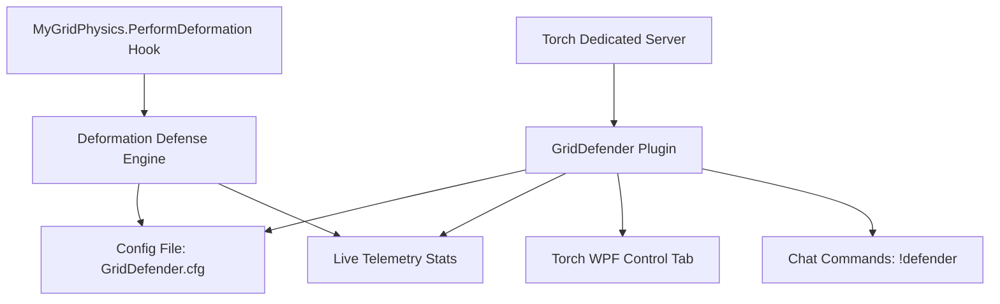
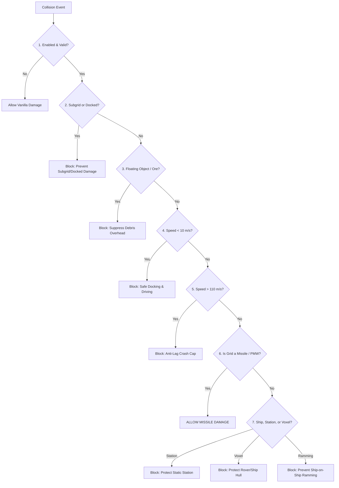

# Project Design Document: GVK GridDefender

**Plugin Type**: Torch Dedicated Server Plugin (.NET 4.8)  
**Target Server**: GV - Deserts of Kharak (GVK)  
**Package**: `GVK_GridDefender.zip`  
**Version**: 2.0.0  

---

## 1. Project Intent & Philosophy

In Space Engineers, collisions between large grids or terrain consume up to 60% of server CPU time due to complex mesh deformation calculations and continuous Havok contact loops (*The Clang Loop*). 

**`GridDefender`** automates collision management to maintain **60 TPS server sim-speed** while preserving tactical combat:
* 🛡️ **Protects Ships & Rovers**: Blocks destructive deformation from accidental terrain crashes, safe docking bumps, and ship-on-ship ramming.
* 🚀 **Allows Missiles (PMWs)**: Player-made missiles and kinetic torpedoes matching designated size/speed limits deal full impact damage.
* ⚡ **Anti-Clang & Push-Apart**: Stops violent physics jitter, zeroes rotational death-spins, and gently separates stuck grids.
* 🔒 **Zero "Trust Me Bro™" Rules**: All collision constraints are enforced programmatically in code—no manual admin refereeing needed.

---

## 2. System Architecture



---

## 3. The 7-Step Collision Pipeline

When any grid collides with another entity, the engine evaluates the collision through **7 fast, short-circuiting steps**:



### Pipeline Summary Table

| Step | Check | Default Rule | Action if Triggered |
| :---: | :--- | :--- | :--- |
| **1** | **Plugin Enabled** | `Enabled = true` | If disabled, pass through to vanilla game code. |
| **2** | **Subgrid & Docking Protection** | `ProtectSubgrids = true` | Blocks self-damage between mechanical subgrids (rotors/pistons) and connector-docked grids. |
| **3** | **Floating Debris** | `ProtectAgainstFloatingObjects = true` | Blocks deformation from dropped items and mined ores. |
| **4** | **Safe Docking Speed** | `MinDrivingVelocity = 10 m/s` | Collisions under 10 m/s are safe (docking, parking, driving). |
| **5** | **Extreme Speed Cap** | `MaxDeformationVelocity = 110 m/s` | Collisions over 110 m/s skip deformation to prevent server freezes. |
| **6** | **Missile (PMW) Gate** | Large: `5–50` blocks \| Small: `10–150` blocks \| Speed $\ge 20\text{ m/s}$ | **ALLOWED**: Deals real impact deformation damage. |
| **7** | **Non-Missile Filtering** | `ProtectShipsAgainstRamming`, `ProtectShipsAgainstVoxels`, `ProtectStaticGrids` | **BLOCKED**: Ships, stations, and terrain take 0 deformation damage. |

---

## 4. Anti-Clang & Active Push-Apart Mechanics

When deformation is blocked, overlapping physics hulls are stabilized across two automatic phases:

```
Contact Starts ───────────────► 8 Consecutive Frames ───────────────► 25 Consecutive Frames (~0.4s)
[Normal Impact]                 [Phase 1: Anti-Clang]                [Phase 2: Active Push-Apart]
• Deformation blocked           • Bleeds 75% linear speed            • Nudges grids apart by 0.50m
• Impact damped (50%)           • Absorbs 80% rotational torque      • Skipped on subgrids & connectors
                                • Zeroes spins > 16 rad/s (38 RPM)     (avoids fighting joint constraints)
```

* **Phase 1 (Anti-Clang Damping)**: Bleeds kinetic energy and kills high-speed rotational death-spins ($> 16\text{ rad}^2/\text{s}^2$) on all colliding entities.
* **Phase 2 (Active Push-Apart)**: Gently translates independent stuck grids $+0.50\text{m}$ outward with a $0.8\text{ m/s}$ release drift.

---

## 5. Engineering Particularities & Edge Cases

### A. Subgrid Constraint Safety (Rotors, Pistons & Hinges)
* **The Havok Joint Conflict**: Mechanically connected subgrids share an active `HkConstraint`. Forcefully nudging/translating subgrids via Push-Apart would create distance violations in the joint, causing the Havok solver to pull back with near-infinite spring tension (phantom torque and stretched rotor heads).
* **The Solution**: Push-Apart Phase 2 is **strictly disabled** for grids in the same `MechanicalGroup`. Subgrids receive full Phase 1 vibration damping and death-spin zeroing without moving coordinates.
* **Why We Avoid Modifying Havok Broadphase Layers**: Modifying raw Havok `CollisionFilterInfo` on dynamic player subgrids causes ghost missiles that phase through enemy ships upon detachment, layer corruption during combat splits, and broken turret raycasts.

### B. Connector Docking Lifecycle (Logical Groups)
* **Approach & Alignment ($< 10\text{ m/s}$)**: Safe docking speed gate prevents damage when bumping connector collars or landing gear.
* **Locked & Connected**: Both grids enter the same `LogicalGroup` (`MyCubeGridGroups.Static.Logical`) with an `HkFixedConstraint`. Deformation is blocked, Anti-Clang prevents suspension wobble, and Push-Apart translation is disabled to protect the connector lock.
* **Undocking**: Unlocking instantly separates the logical group; departure speeds $< 10\text{ m/s}$ remain protected until clear.

### C. Suspension Wheels (Native Broadphase Optimizer)
* **Keen's Wheel Well AABB Flaw**: Although vanilla Space Engineers sets `(1, 1)` sub-system masks, the chassis remains on `(0, 0)`. Because the masks are asymmetrical, Havok still executes high-frequency broadphase bounding-box (AABB) compound queries against all nearby armor blocks (fenders, wheel skirts, and wheel wells) every single tick.
* **Integrated GridDefender Fix (`MotorSuspensionPatch`)**: When a suspension wheel attaches or recalculates physics, GridDefender applies **symmetrical sub-system masking** (`subSystemDontCollideWith = 3` bits 0 and 1). Havok immediately ignores the parent chassis compound shape from both directions.
* **Result**: Zero redundant AABB compound tree queries, zero wheel well lag, and **the wheel remains on its 100% native physics layer** (colliding normally with voxels, terrain, obstacles, and enemy ships without needing external layer hacks).

### D. Planetary Gravity & Pertam Terrain Phasing
* **Skyward Up-Vector**: When a rover gets stuck or phased into terrain voxels on a planet, Push-Apart calculates $-\text{Normalize}(\vec{g})$ (the local gravity up-vector) rather than an arbitrary normal. The rover pops safely **straight up toward the sky** rather than digging deeper into the dune.

### E. Missile (PMW) Staging & Combat Transitions
* **Attached on Launch Rail**: While attached to a rotor or connector, the torpedo is treated as a subgrid (protected from self-damage and push-apart).
* **Fired / Detached**: The moment the joint detaches or is severed, it instantly transitions to an independent grid. If it meets missile criteria ($5–50$ large / $10–150$ small blocks at $\ge 20\text{ m/s}$), it deals full impact deformation damage on target.

---

## 6. Key Settings & Defaults

| Setting | Default | Description |
| :--- | :---: | :--- |
| `AllowMissileDamage` | `true` | Enables real impact deformation for player-made missiles. |
| `LargeGridMissileBlocks` | `5 – 50` | Block range for Large Grid torpedoes. |
| `SmallGridMissileBlocks` | `10 – 150` | Block range for Small Grid missiles. |
| `MissileMinVelocity` | `20.0 m/s` | Minimum speed to count as a missile hit. |
| `ProtectShipsAgainstRamming` | `true` | Prevents ship-on-ship ramming damage. |
| `ProtectShipsAgainstVoxels` | `true` | Prevents terrain and asteroid crash damage. |
| `ProtectSubgrids` | `true` | Prevents self-damage on rotors, pistons, hinges, and connectors. |
| `MinDrivingVelocity` | `10.0 m/s` | Safe driving & parking speed threshold. |
| `ImpactVelocityDamping` | `0.50` | Absorbs 50% kinetic energy on protected collisions. |
| `PushApartDistance` | `0.50 m` | Distance to nudge stuck grids apart. |

---

## 7. Chat Commands (`!defender`)

### For Players
* `!defender rules` — View current missile sizes, speed limits, and safe docking speeds.
* `!defender check <large|small> <blocks> <speed>` — Test if a grid design qualifies as a missile or protected ship.

### For Admins
* `!defender status` — View active configuration summary.
* `!defender stats` — View real-time collision telemetry (crashes blocked, missile hits allowed).
* `!defender toggle` — Master plugin on/off switch.
* `!defender set <property> <value>` — Change any setting on the fly (e.g. `!defender set missilespeed 25`).
* `!defender reload` — Reload configuration from disk.

---

## 8. Developer Rules of Engagement

1. **Zero Hot-Path Allocations**: Never allocate objects (`new`, LINQ, closures) inside `ShouldAllowDeformation`.
2. **Synchronized UI & CLI**: Every config property must be exposed in `GridDefenderConfig`, bound in the WPF UI, and accessible via `!defender set`.
3. **Decoupled Telemetry**: Increment statistics with atomic `Interlocked` primitives; refresh the GUI via a 500ms Dispatcher timer.
