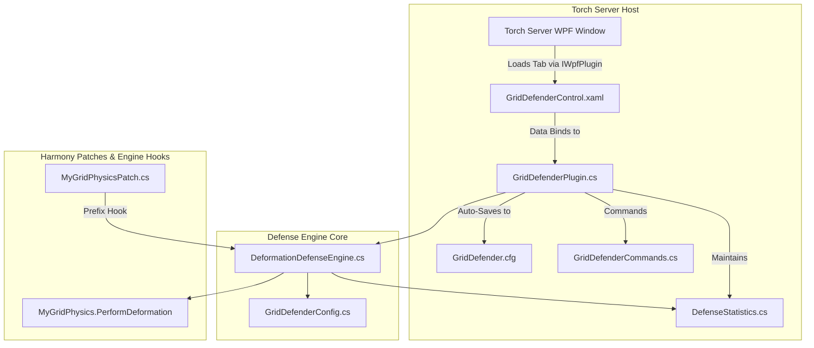
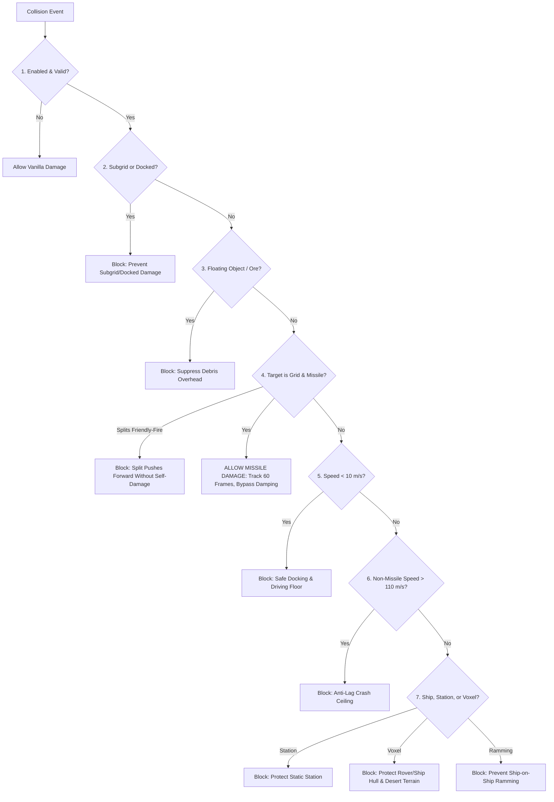

# 🛡️ GVK GridDefender

**High-Performance Collision Defense, Missile Allowance & Anti-Clang System for Space Engineers Torch Servers**

* **Plugin Type**: Torch Dedicated Server Plugin (.NET Framework 4.8)  
* **Target Server**: GV - Deserts of Kharak (GVK)  
* **Package**: `GVK_GridDefender.zip`  
* **Version**: 2.0.0  

---

## 1. Project Intent & Philosophy

In Space Engineers, collisions between large grids or voxel terrain consume up to 60% of server CPU time due to complex mesh deformation calculations, continuous contact manifold updates, and persistent physics oscillation loops (*The Clang Loop*).

**`GridDefender`** automates collision management to maintain **60 TPS server sim-speed** while preserving tactical vehicle and missile combat:
* 🛡️ **Protects Ships & Rovers**: Blocks destructive deformation damage from accidental terrain crashes, safe docking bumps, and ship-on-ship ramming.
* 🚀 **Allows Missiles (PMWs)**: Player-made missiles and kinetic torpedoes matching designated size/speed limits deal full impact deformation damage.
* ⚡ **Anti-Clang Kinetic Absorption**: Stops violent physics jitter, absorbs collision oscillations, and zeroes rotational death-spins.
* 🧲 **Active Push-Apart (Anti-Stuck)**: Automatically and gently separates stuck or phased grids with skyward terrain repulsion.
* 🔒 **Zero "Trust Me Bro™" Rules**: All collision constraints and missile thresholds are enforced programmatically in code—zero manual admin policing.
* ⚡ **Zero Hot-Path Allocations**: Pure zero-allocation architecture inside `MyGridPhysics.PerformDeformation` hooks.
* 🏎️ **PhysicsOptimizer Harmony**: Works in unison with `GVK.PhysicsOptimizations` (PhysicsOptimizer handles simulation performance and wheel suspension sleeping, while GridDefender handles kinetic defense).

---

## 2. System Architecture



### Project Structure & Key Components

| Component | File | Purpose |
| :--- | :--- | :--- |
| **Plugin Entry** | [`GridDefenderPlugin.cs`](GridDefender/GridDefenderPlugin.cs) | Main lifecycle controller (`TorchPluginBase`, `IWpfPlugin`). Manages persistent config, statistics, defense engine, and PatchManager. |
| **Config Model** | [`Config/GridDefenderConfig.cs`](GridDefender/Config/GridDefenderConfig.cs) | Persistent ViewModel containing all configurable thresholds, damage multipliers, and toggles with Torch `[Display]` annotations. |
| **Defense Engine**| [`Engine/DeformationDefenseEngine.cs`](GridDefender/Engine/DeformationDefenseEngine.cs) | Core 7-step collision evaluation engine, missile gate verification, anti-clang damping, and push-apart routines. |
| **Statistics** | [`Services/DefenseStatistics.cs`](GridDefender/Services/DefenseStatistics.cs) | Thread-safe real-time telemetry tracking evaluated collisions, crashes blocked, missile hits allowed, and Clang vibrations arrested. |
| **Physics Patch** | [`Patches/MyGridPhysicsPatch.cs`](GridDefender/Patches/MyGridPhysicsPatch.cs) | Prefix hook on `MyGridPhysics.PerformDeformation` routing collision damage decisions through the defense engine. |
| **Commands** | [`Commands/GridDefenderCommands.cs`](GridDefender/Commands/GridDefenderCommands.cs) | In-game chat and console admin/player commands under the `!defender` prefix. |
| **WPF GUI View** | [`Views/GridDefenderControl.xaml`](GridDefender/Views/GridDefenderControl.xaml) | Dark-themed WPF interface with **Configuration** and **Live Telemetry** tabs. |
| **Grid Utilities** | [`Utils/GridUtils.cs`](GridDefender/Utils/GridUtils.cs) | High-performance helper methods for grid size, speed, mechanical group checks, and pilot status. |

---

## 3. Pipeline & Mechanics Deep-Dive

### How GridDefender Intercepts: Torch Prefix Hook vs. Keen's Deformation Pipeline

To understand why GridDefender achieves **zero sim-speed loss during high-speed collisions**, consider what happens in vanilla Space Engineers:

```
[Vanilla Space Engineers Collision]
Havok Contact Manifold Detected
       │
       ▼
MyGridPhysics.PerformDeformation()
       ├── 1. Bone Recalculation: Iterates adjacent armor blocks & recalculates skeletal deformation matrices
       ├── 2. Structural Health Math: Deducts kinetic damage from individual block definitions
       ├── 3. Vertex Displacement: Displaces mesh vertex buffers for crushed armor visuals
       ├── 4. Compound Splitting: Checks if the grid fractured into multiple pieces (CheckGridSplits)
       └── 5. Particle & Voxel Overhead: Spawns spark emitters, sounds, and deforms terrain
  ══════════════════════════════════════════════════════════════════════════════
  Result: Hundreds of complex iterations per tick ──► Sim-Speed drops to 0.15 TPS (Clang Spike)
```

```
[GridDefender Torch Prefix Interception]
Havok Contact Manifold Detected
       │
       ▼
MyGridPhysics.PerformDeformation() ──► [Torch Prefix Hook: MyGridPhysicsPatch.Prefix]
                                               │
               ┌───────────────────────────────┴───────────────────────────────┐
               ▼                                                               ▼
       [Valid Missile?]                                              [Protected Collision]
        • Within block bounds?                                        • Ship-on-Ship Ramming
        • Speed ≥ 20 m/s?                                             • Rover / Ship hitting Voxels
        • Against target grid?                                        • Static Station Hit
               │                                                      • Docking Bump (< 5 m/s)
               ▼                                                               │
          return true;                                                         ▼
       (Proceed to Vanilla)                                              return false;
               │                                                      (🛑 FULL SHORT-CIRCUIT)
               ▼                                                               │
  100% Unimpeded Kinetic & Deformation                                         ▼
  Damage Allowed (Torpedos punch deep holes)                     Keen's entire PerformDeformation()
                                                                 is completely bypassed in ~0.002ms:
                                                                 • 0 bone math
                                                                 • 0 block health math
                                                                 • 0 mesh vertex allocations
                                                                 • Momentum transfers cleanly via Havok
```

#### Why Havok Momentum is Preserved
GridDefender hooks `PerformDeformation` (the structural destruction and bone crushing phase), **not** Havok's low-level rigid-body contact solver. 
- Colliding ships still bounce, slide, and push each other naturally according to Havok's physics equations.
- They act like tough desert bumper cars—preserving physical momentum and realism while totally eliminating CPU-crushing armor damage calculations.

---

### The 7-Step Collision Evaluation Pipeline

When any grid collides with another entity, the engine evaluates the collision through **fast, short-circuiting steps**:



### Pipeline Summary Table

| Step | Check | Default Rule | Action if Triggered |
| :---: | :--- | :--- | :--- |
| **1** | **Plugin Enabled** | `Enabled = true` | If disabled, pass through to vanilla game code. |
| **2** | **Subgrid & Docking Protection** | `ProtectSubgrids = true` | Blocks self-damage between mechanical subgrids (rotors/pistons) and connector-docked grids. |
| **3** | **Floating Debris** | `ProtectAgainstFloatingObjects = true` | Blocks deformation from dropped items and mined ores. |
| **4** | **Missile (PMW) Gate & Splits** | Large: `3–50` blocks \| Small: `4–150` blocks \| Speed $\ge 20\text{ m/s}$ | **ALLOWED**: Deals 100% unimpeded deformation damage against target grids. Splits inherit tracking; self-damage between splits is suppressed. |
| **5** | **Safe Docking Speed Floor** | `MinDrivingVelocity = 10 m/s` | Collisions under 10 m/s are safe (docking, parking, gentle driving). |
| **6** | **Extreme Speed Lag Cap** | `MaxDeformationVelocity = 110 m/s` | Non-missile collisions over 110 m/s skip deformation to prevent server freezes. Missiles bypass this cap. |
| **7** | **Non-Missile Filtering** | `ProtectShipsAgainstRamming`, `ProtectShipsAgainstVoxels`, `ProtectStaticGrids` | **BLOCKED**: Ships, stations, and terrain take 0 deformation damage. |

---

### Anti-Clang & Active Push-Apart Mechanics

When deformation is blocked, overlapping physics hulls are stabilized across two automatic phases:

```
Contact Starts ───────────────► 8 Consecutive Frames ───────────────► 25 Consecutive Frames (~0.4s)
[Normal Impact]                 [Phase 1: Anti-Clang]                [Phase 2: Active Push-Apart]
• Deformation blocked           • Bleeds 75% linear speed            • Nudges grids apart by 0.50m
• Impact damped (50%)           • Absorbs 80% rotational torque      • Skipped on subgrids & connectors
                                • Zeroes spins > 16 rad/s (38 RPM)     (avoids fighting joint constraints)
```

* **Phase 1 (Anti-Clang Damping)**: Bleeds kinetic energy and kills high-speed rotational death-spins ($> 16\text{ rad}^2/\text{s}^2$) on all colliding entities.
* **Phase 2 (Active Push-Apart)**: Gently translates independent stuck grids $+0.50\text{m}$ outward with a $0.8\text{ m/s}$ release drift.

---

## 4. Engineering Particularities & Edge Cases

### A. Subgrid Constraint Safety (Rotors, Pistons & Hinges)
* **The Havok Joint Conflict**: Mechanically connected subgrids share an active `HkConstraint`. Forcefully translating subgrids via Push-Apart would create distance violations in the joint, causing the Havok solver to pull back with near-infinite spring tension (phantom torque and stretched rotor heads).
* **The Solution**: Push-Apart Phase 2 is **strictly disabled** for grids in the same `MechanicalGroup`. Subgrids receive full Phase 1 vibration damping and death-spin zeroing without moving coordinates.

### B. Connector Docking Lifecycle (Logical Groups)
* **Approach & Alignment ($< 10\text{ m/s}$)**: Safe docking speed gate prevents damage when bumping connector collars or landing gear.
* **Locked & Connected**: Both grids enter the same `LogicalGroup` (`MyCubeGridGroups.Static.Logical`) with an `HkFixedConstraint`. Deformation is blocked, Anti-Clang prevents suspension wobble, and Push-Apart translation is disabled to protect the connector lock.
* **Undocking**: Unlocking instantly separates the logical group; departure speeds $< 10\text{ m/s}$ remain protected until clear.

### C. Planetary Gravity & Pertam Terrain Phasing
* **Skyward Up-Vector**: When a rover gets stuck or phased into terrain voxels on a planet, Push-Apart calculates $-\text{Normalize}(\vec{g})$ (the local gravity up-vector) rather than an arbitrary normal. The rover pops safely **straight up toward the sky** rather than digging deeper into the dune.

### D. Vehicular Physics & Wheel Optimizations
* **Consolidated in `PhysicsOptimizer`**: All wheel collision layer filtering (symmetrical sub-system masking `subSystemDontCollideWith = 3`) and parked rover suspension sleeping are managed by **`GVK.PhysicsOptimizations`** to ensure unified vehicular performance across the server without duplicate or competing hooks.

### E. Missile (PMW) 3-Phase Lifecycle & Anti-Clang Transition
* **Phase 1: Active Kinetic Penetration (60 Frames / ~1.0s)**:
  * When a detached grid meeting missile criteria strikes an enemy target at $\ge 20\text{ m/s}$, it enters an active engagement session.
  * All penetrating blocks and subsequent splits deal **100% unimpeded vanilla deformation damage**.
  * Linear velocity damping is completely bypassed so penetrators retain full kinetic momentum.
  * Torsional death-spins ($> 16\text{ rad/s}$) are zeroed if Havok glitches, without bleeding forward punching speed.
* **Phase 2: Split Safety (Friendly-Fire Shield & Battering Ram)**:
  * All splits from the same missile share a `MissileGroupId`. Deformation damage between pieces of the same missile is suppressed so rear thruster/mass chunks act as a kinetic battering ram against the forward penetrator without destroying each other in mid-air.
* **Phase 3: Spent Debris Transition & Anti-Clang**:
  * The moment forward speed drops below `MissileMinVelocity` or the active window expires, the spent missile husk transitions into standard grid debris.
  * Wedged remnants inside the target hull are immediately stabilized by **Phase 1 Anti-Clang** (vibration absorption) and **Phase 2 Push-Apart** (gentle separation) to prevent physics lag loops.
* **Multi-Plugin Cleanup Safety**:
  * Tracked entities register `OnClose` handlers to immediately purge IDs if external server cleanup plugins delete small splits ($\le 2$ blocks), preventing null reference exceptions.

### F. Universal Voxel Preservation & Drill Mining
* **Explosion & Crash Suppression**: Prefixes `MyExplosion.CutOutVoxelMap` and disables `MyFakes.DEFORMATION_EXPLOSIONS` so warheads, artillery, weapons, and crashes never crater graded Pertam highways.
* **Drill Mining Untouched**: Hand drills and ship drills (`MyDrillBase`) use direct voxel harvest pipelines and continue mining/harvesting ores 100% normally.

---

## 5. In-Game & Console Admin Commands (`!defender`)

Commands use the `!defender` prefix.

### For Players (`MyPromoteLevel.None`)
* `!defender rules` — Explains current missile sizes, speed limits, and safe docking speeds.
* `!defender check <large|small> <blocks> <speed>` — Tests if a grid design qualifies as a missile or protected ship.

### For Admins (`MyPromoteLevel.Admin`)
* `!defender status` — Displays current configuration summary.
* `!defender stats` — Displays real-time collision telemetry (crashes blocked, missile hits allowed, Clang vibrations arrested).
* `!defender resetstats` — Resets all defense telemetry counters to zero.
* `!defender toggle` — Master plugin on/off toggle.
* `!defender togglevoxels` — Toggles voxel and asteroid collision protection on/off.
* `!defender set <property> <value>` — Modifies a configuration parameter dynamically on the fly (e.g. `!defender set missilespeed 25` or `!defender set suppresscutouts true`).
* `!defender reload` — Reloads configuration from disk.

---

## 6. Configuration Reference (`GridDefender.cfg`)

The configuration file is saved automatically to `Torch\Plugins\Storage\GridDefender\GridDefender.cfg` (or in the plugin directory).

### Configuration Options Table

| Setting | Type | Default | Description |
| :--- | :---: | :---: | :--- |
| `Enabled` | `bool` | `true` | Master toggle for GridDefender collision management. |
| `EnableDebugLogging` | `bool` | `false` | Enables verbose trace logging in Torch console. |
| `DeformationMultiplier` | `float` | `1.0` | Damage scale factor when deformation is allowed for missiles (0.0 to 1.0). |
| `AllowMissileDamage` | `bool` | `true` | Allows player-made missiles to deal impact deformation damage to enemy grids. |
| `LargeGridMissileMinBlocks` | `int` | `3` | Minimum block count for a large grid missile. |
| `LargeGridMissileMaxBlocks` | `int` | `50` | Maximum block count for a large grid missile. |
| `SmallGridMissileMinBlocks` | `int` | `4` | Minimum block count for a small grid missile. |
| `SmallGridMissileMaxBlocks` | `int` | `150` | Maximum block count for a small grid missile. |
| `MissileMinVelocity` | `float` | `20.0` | Minimum speed (m/s) required to deal missile impact damage. |
| `ProtectShipsAgainstRamming` | `bool` | `true` | Blocks deformation damage from ship-on-ship ramming. |
| `ProtectShipsAgainstVoxels` | `bool` | `true` | Blocks deformation damage when ships/rovers bump terrain/asteroids. |
| `SuppressAllVoxelExplosionDamage` | `bool` | `true` | Suppresses voxel craters from all explosions, weapons, and crashes while preserving drill mining. |
| `ProtectAgainstFloatingObjects` | `bool` | `true` | Suppresses deformation from floating ores, items, and debris. |
| `ProtectStaticGrids` | `bool` | `true` | Suppresses deformation on stations when rammed by ships. |
| `ProtectSubgrids` | `bool` | `true` | Suppresses self-deformation between connected subgrids. |
| `EnableAntiClang` | `bool` | `true` | Enables physics vibration and death-spin damping. |
| `ImpactVelocityDamping` | `float` | `0.50` | Kinetic energy absorption factor on protected impacts (0.0 to 1.0). |
| `AntiClangVibrationThreshold` | `int` | `8` | Consecutive contact frames before forcefully damping oscillations. |
| `StopClangSpinning` | `bool` | `true` | Instantly zeroes out extreme rotational death spins. |
| `EnablePushApart` | `bool` | `true` | Automatically nudges stuck grids apart. |
| `PushApartThreshold` | `int` | `25` | Consecutive contact frames before executing push-apart (~0.4s). |
| `PushApartDistance` | `float` | `0.50` | Distance in meters to gently nudge grids apart. |
| `MinDrivingVelocity` | `float` | `10.0` | Collisions below this speed never cause deformation (safe docking/driving). |
| `MaxDeformationVelocity` | `float` | `110.0` | Extreme-speed non-missile collisions above this speed skip deformation to prevent server freezes. |
| `DeformationCooldownFrames` | `int` | `30` | Minimum simulation frames between deformation passes per grid during continuous contact. |

---

## 7. Torch WPF Server Interface

The GUI integrates into the Torch Server window, matching the standard dark-themed layout of `PhysicsOptimizer` and `TorchRemoteCleanupPlugin`:

1. **Configuration Tab**:
   * Quick overview banner explaining missile vs ship protection rules.
   * Granular toggles and sliders for missile thresholds, safety limits, anti-clang damping, and push-apart separation.
   * Quick **"Save Configuration"** button.
2. **Live Telemetry Tab**:
   * **4-Column Metric Card**: Total Evaluated (Blue), Crashes Blocked (Green), Block Ratio (Orange), and 🚀 Missile Hits (Pink).
   * **Detailed Telemetry Breakdown**: Missile impacts allowed, Clang vibrations arrested, grids separated via push-apart, ship ramming blocked, voxel crashes blocked, and subgrid collisions blocked.
   * **Manual Action Controls**: `Reset Telemetry Counters`.

---

## 8. Building & Deployment

### 1. Configure Torch Directory Path
Open [`GridDefender.csproj`](GridDefender/GridDefender.csproj) and verify `<TorchDir>`:
```xml
<TorchDir>C:\SE_GVK_S10</TorchDir>
```

### 2. Build the Solution
```bash
dotnet build -c Release GridDefender\GridDefender.csproj
```
The build automatically creates and deploys the zip archive:
```
C:\SE_GVK_S10\Plugins\GVK_GridDefender.zip
├── GVK.GridDefender.dll
├── GVK.GridDefender.pdb
└── manifest.xml
```

---

## 9. In-Game Testing Checklist

1. **GUI & Persistence Verification**:
   - [ ] Start Torch Server $\rightarrow$ Open **GridDefender** tab.
   - [ ] Verify both **Configuration** and **Live Telemetry** tabs are populated.
   - [ ] Modify a threshold (e.g. Missile Min Velocity) and click **Save Configuration**.
2. **Safe Docking & Driving Verification**:
   - [ ] Fly a ship into a station or landing pad at $< 10 \text{ m/s}$.
   - [ ] Verify 0 deformation damage is taken and **Crashes Blocked** increments.
3. **Missile (PMW) Verification**:
   - [ ] Build a small grid missile (25 blocks) and launch it at a target at $> 30 \text{ m/s}$.
   - [ ] Verify real impact deformation damage is dealt and **Missile Hits Allowed** increments.
4. **Anti-Ramming Verification**:
   - [ ] Ram a 500-block cruiser into another cruiser at $50 \text{ m/s}$.
   - [ ] Verify deformation damage is blocked, kinetic damping slows the collision, and **Ramming Blocked** increments.
5. **Anti-Clang & Push-Apart Verification**:
   - [ ] Wedge two dynamic ships tightly together against a voxel wall.
   - [ ] Verify Phase 1 damping absorbs the vibration and Phase 2 pushes the ships $0.5\text{m}$ apart cleanly.

---

## 10. License & Credits

* **Author**: GVK Modding Team
* **Target Server**: GV - Deserts of Kharak (GVK)
* **License**: MIT

